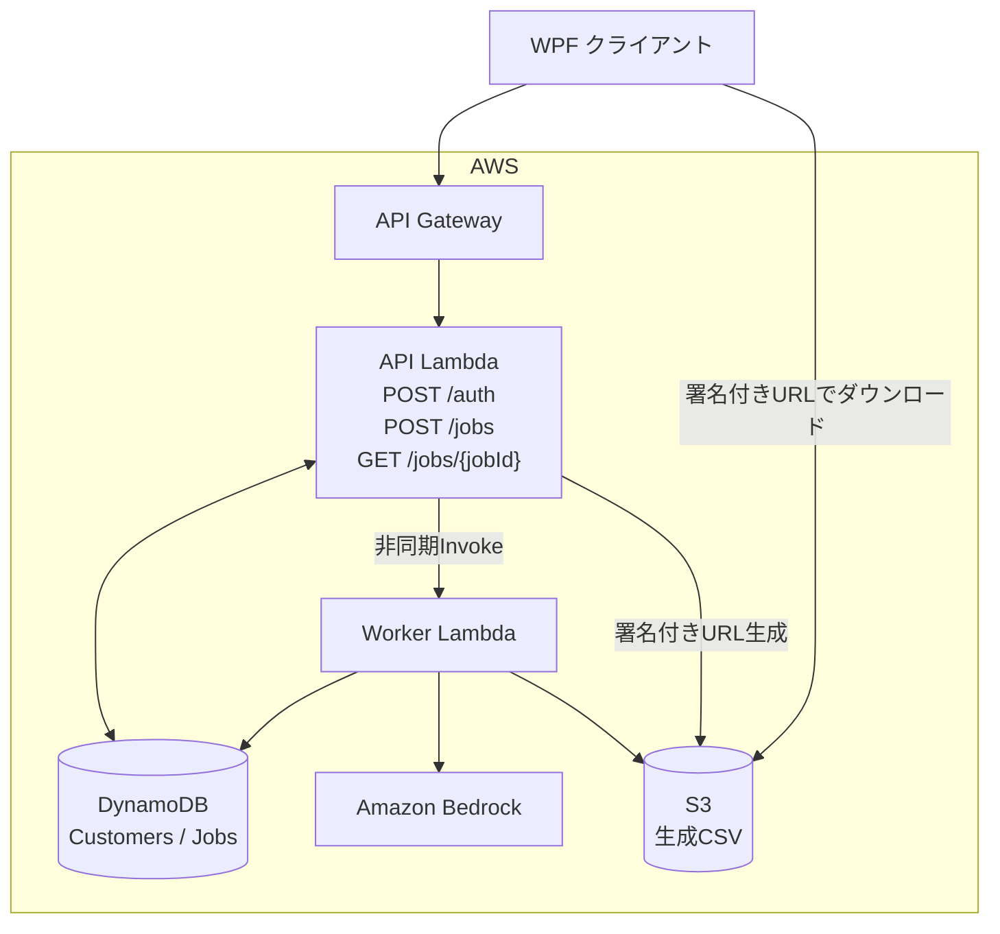

# Bedrock 非同期API構成案

## 概要

WPF（.NET Framework 4.8）→ API Gateway（HTTP API）→ API Lambda（Python）で認証・ジョブ受付・状態照会を行い、別の Worker Lambda が Bedrock を非同期実行する設計案です。FastAPIは使用しません。

## Lambdaの責務

| Lambda | 役割 | API |
| --- | --- | --- |
| API Lambda | 保守キーと顧客の照合、短期アクセストークン発行、認証検証、ジョブ登録・照会、ダウンロードURL生成 | `POST /auth`, `POST /jobs`, `GET /jobs/{jobId}` |
| Worker Lambda | Bedrock実行、CSV生成、S3保存、ジョブ状態更新 | HTTPエンドポイントなし |

## IAM実行ロール設計

それぞれ独立したIAM実行ロールを使用します。対象リソースは実際のARNに限定します。

| ロール例 | アクション | 対象・目的 |
| --- | --- | --- |
| ApiLambdaExecutionRole | `dynamodb:GetItem` | Customers / Jobs取得 |
| ApiLambdaExecutionRole | `dynamodb:PutItem` | Jobs登録 |
| ApiLambdaExecutionRole | `lambda:InvokeFunction` | Worker Lambdaのみ |
| ApiLambdaExecutionRole | `s3:GetObject` | 成果物の署名付きURL生成用 |
| WorkerLambdaExecutionRole | `bedrock:InvokeModel` | 対象モデル／推論プロファイルのみ |
| WorkerLambdaExecutionRole | `dynamodb:UpdateItem` | Jobs状態更新 |
| WorkerLambdaExecutionRole | `s3:PutObject` | CSVの保存先プレフィックスのみ |
| 両ロール | CloudWatch Logsへの書き込み | Lambda実行ログ |

両ロールの信頼ポリシーは `lambda.amazonaws.com` が `sts:AssumeRole` を実行できる形にします。API LambdaにはBedrock直接呼び出し権限を与えません。必要に応じてDynamoDBのインデックス参照、KMS、Secrets Manager権限を追加します。

## ジョブ状態

`QUEUED → RUNNING → SUCCEEDED` または `FAILED`。重複実行を考慮した冪等処理、非同期Invoke失敗時の整合性、失敗送信先、滞留ジョブ監視が必要です。

## セキュリティと未決定事項

- 保守キーは平文で保存しない。認証トークンの署名・有効期限・検証方式を確定する。
- 後続APIは顧客IDを認証トークンから確定し、ジョブ所有者を検証する。
- S3バケットは非公開とし、成功後に短命の署名付きURLを発行する。
- GitHubに保守キー、AWSアクセスキー、トークン署名秘密鍵などを保存しない。
- 既存の保守キーの形式、Bedrockモデル、CSV仕様、保存期間、最大処理時間は未確定。
- 将来、非同期処理の信頼性向上が必要ならSQS導入を検討する。

関連: [API仕様](api-spec.md) / [シーケンス](sequence.md)
