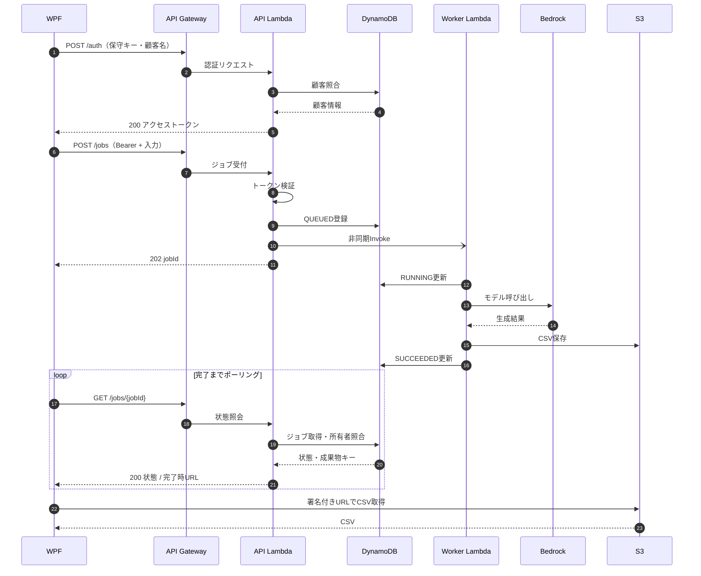

# 処理シーケンス（ドラフト）

```mermaid
sequenceDiagram
    autonumber
    participant C as WPF
    participant G as API Gateway
    participant A as API Lambda
    participant D as DynamoDB
    participant W as Worker Lambda
    participant B as Bedrock
    participant S as S3
    C->>G: POST /auth（保守キー・顧客名）
    G->>A: 認証リクエスト
    A->>D: 顧客照合
    D-->>A: 顧客情報
    A-->>C: 200 アクセストークン
    C->>G: POST /jobs（Bearer + 入力）
    G->>A: ジョブ受付
    A->>A: トークン検証
    A->>D: QUEUED登録
    A-)W: 非同期Invoke
    A-->>C: 202 jobId
    W->>D: RUNNING更新
    W->>B: モデル呼び出し
    B-->>W: 生成結果
    W->>S: CSV保存
    W->>D: SUCCEEDED更新
    loop 完了までポーリング
        C->>G: GET /jobs/{jobId}
        G->>A: 状態照会
        A->>D: ジョブ取得・所有者照合
        D-->>A: 状態・成果物キー
        A-->>C: 200 状態 / 完了時URL
    end
    C->>S: 署名付きURLでCSV取得
    S-->>C: CSV
```

失敗時にはWorkerが `FAILED` とエラーコードをJobsに記録する想定。非同期Invokeの重複配送や再試行、Lambda中断、ジョブ滞留、S3保存後の状態更新失敗を想定した冪等処理・監視が必要です。

関連: [構成設計](architecture.md) / [API仕様](api-spec.md)
