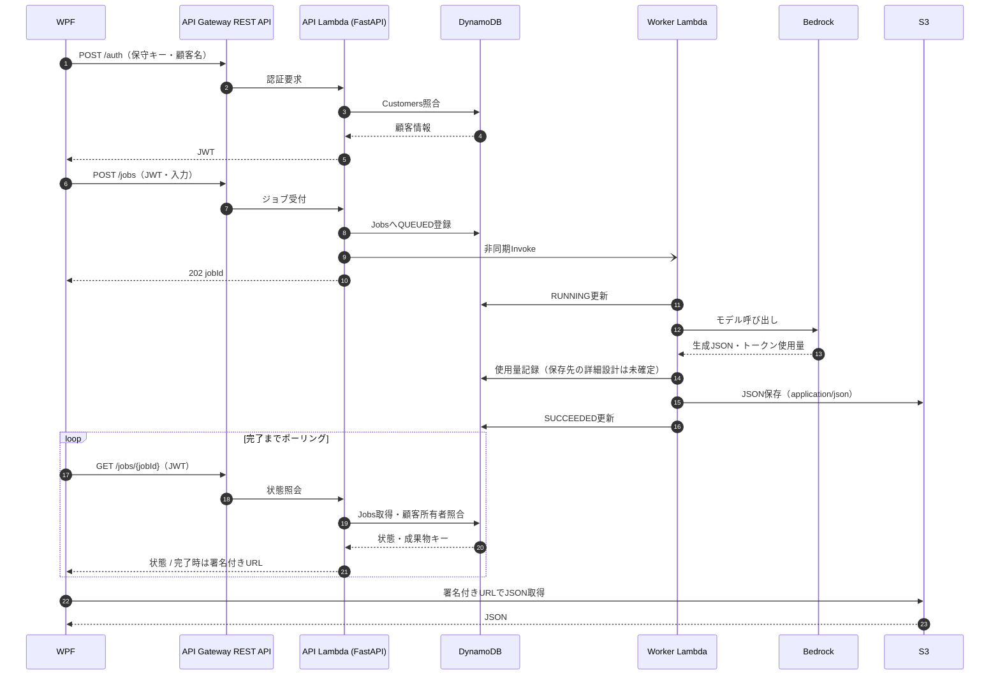

# 処理シーケンス

```mermaid
sequenceDiagram
    autonumber
    participant C as WPF
    participant G as API Gateway REST API
    participant A as API Lambda (FastAPI)
    participant D as DynamoDB
    participant W as Worker Lambda
    participant B as Bedrock
    participant S as S3
    C->>G: POST /auth（保守キー・顧客名）
    G->>A: 認証要求
    A->>D: Customers照合
    D-->>A: 顧客情報
    A-->>C: JWT
    C->>G: POST /jobs（JWT・入力）
    G->>A: ジョブ受付
    A->>D: JobsへQUEUED登録
    A-)W: 非同期Invoke
    A-->>C: 202 jobId
    W->>D: RUNNING更新
    W->>B: モデル呼び出し
    B-->>W: 生成JSON・トークン使用量
    W->>D: 使用量記録（保存先の詳細設計は未確定）
    W->>S: JSON保存（application/json）
    W->>D: SUCCEEDED更新
    loop 完了までポーリング
        C->>G: GET /jobs/{jobId}（JWT）
        G->>A: 状態照会
        A->>D: Jobs取得・顧客所有者照合
        D-->>A: 状態・成果物キー
        A-->>C: 状態 / 完了時は署名付きURL
    end
    C->>S: 署名付きURLでJSON取得
    S-->>C: JSON
```

異常時は`FAILED`とエラーコードを記録。非同期再試行・重複起動・S3保存後の状態更新失敗に備え、冪等性と復旧処理を設計する。
